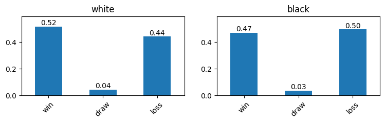
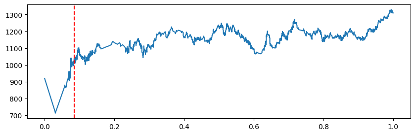
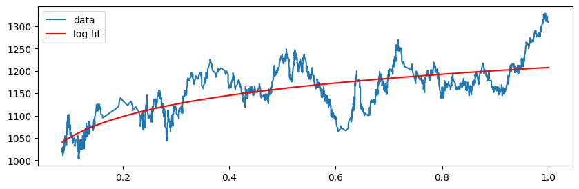
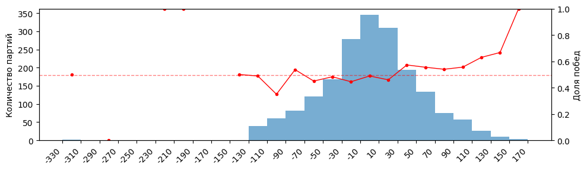
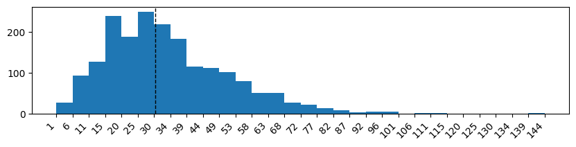
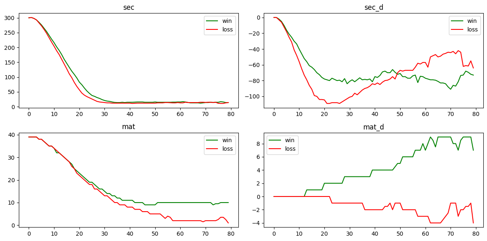
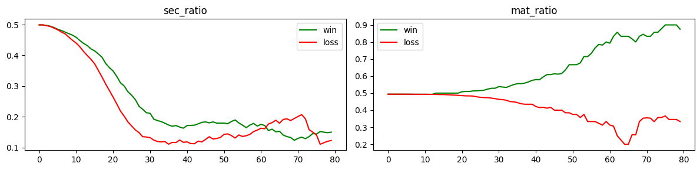
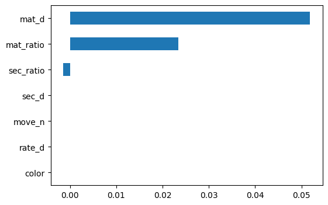
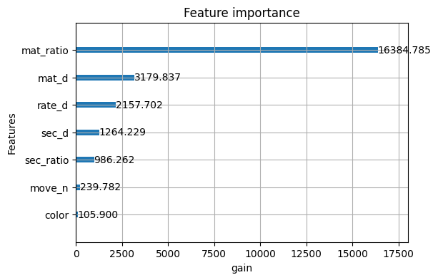

# Предсказание исхода шахматной партии

[*lichess.ipynb*](lichess.ipynb)


## Задача

Предсказание `win / not win` на некотором ходе `move_n` для более новых партий.  

---


## Описание данных и признаков

Источник данных – мои партии с Lichess в формате PGN.  
Только рейтинговые игры, формат blitz 5+3  
(у каждого игрока 5 минут фиксированного времени +3 секунды возвращается за каждый ход).  

Размер датасета `df` со строкой для каждой игры (после очистки) = 1910 строк.  

Признаки разделены на две группы:

До начала игры:  
- Мой рейтинг минус рейтинг соперника `rate_d`
- Цвет моих фигур `color`  

В некоторый момент игры:  
- Номер хода `move_n`.
- `sec` = оставшееся у меня время.  
  Заменил на признак `sec_ratio` = отношение времени, которое осталось у меня, ко времени, которое осталось у нас с соперником вместе.
- `sec_d` = время, которое осталось у меня, минус время, оставшееся у соперника.
- `mat` = сумма весов фигур, которые остались у меня (пешка=1, конь=3, слон=3, ладья=5, ферзь=9, король не учитывается).  
  Заменил на признак `mat_ratio` = отношение веса фигур, оставшихся у меня, к весу фигур, оставшихся у нас с соперником вместе.
- `mat_d` = вес фигур, оставшихся у меня, минус вес фигур соперника.  

Для обучения моделей используется датасет `df_moves` со строкой для каждого хода.  
Размер датасета `df_moves` = 63864 строк.  

---


## Модели

| Модель              | Роль       | Преимущества                           |
|---------------------|------------|----------------------------------------|
| Logistic Regression | Baseline   | Простая, легко интерпретировать        |
| LightGBM            | Prediction | Нелинейности, взаимодействия признаков |

---


## Подготовка окружения

Чтобы установить используемые библиотеки, необходимо запустить скрипт `tools/install.sh`

---


## Загрузка данных

Все мои партии загружаются с помощью скрипта `tools/get_data.py` в файл `tools/__data.pgn`.  
Затем этот же скрипт выбирает партии формата "blitz 5+3" и сохраняет их в файл `data.pgn` в корне проекта.

Далее описаны этапы работы в файле `lichess.ipynb`.


## Подготовка данных

Из `data.pgn` извлекаются заголовки партий и список ходов для каждой партии.  
Оставлены только партии варианта `Standard`.  

Запись ходов содержит метку `[%clk ...]` после каждого полухода – по ней восстанавливается оставшееся время каждого игрока.  
На каждом моем ходу собирается кортеж `(sec, sec_d, mat, mat_d)`.  

Даты партий переведены в нормированный диапазон `[0, 1]`.  

Все признаки добаляются в датасет `df`, с которым работаем далее.  
`df` отсортирован по возрастанию даты.


## EDA и feature engineering

На этом этапе проводится анализ графиков и создание новых переменных.  
Качество новых переменных оцениватся по изменению ROC-AUC для двух моделей на валидационной выборке `val`.  
Разделение на выборки и создание моделей будет описано позже.  

### Соотношение `win` `draw` `loss` в зависимости от цвета

  

Столбчатая диаграмма показывает, что классы сбалансированы.  
Доля побед немного выше за белых.  

---

### Получение весов для обучения `w_train`

  

График рейтинга по дате показал нестабильный начальный участок (`date < 0.085`) – эти партии исключены из `df`.  

  

Затем рейтинг аппроксимирован логарифмом `a * ln(x) + b` с помощью `scipy.optimize.curve_fit`.  
Логарифмическая аппроксимация нормирована в `[0, 1]` и взята как вес `w_train`.  

Получается, вес учитывает давность игры и колебания рейтинга.  

Изменение весов для выборки изменило AUC только для линейной модели:  
`LR 0.697 -> 0.707`

---

### Количество партий и winrate по интервалам `rate_d`



Партии `df[rate_d < -130]` встречаются редко и непредсказуемы.  
Интерпретация: для моего рейтинга такая величина почти всегда означает игру с новым пользователем, которому система присваивает `rate = 1500` до калибровки.  
До завершения калибровки неизвестно, на каком уровне играет пользователь, поэтому `rate_d` в этом случае неинформативен.  

Пробовал признак `is_newbie = (rate_d < -130).astype(int)`.  
Метрики не изменились, удалил.

---

### Число партий, завершенных на ходе из интервала `move_n`



Продолжительные партии встречаются редко.  
На поздних ходах модель обучается на небольшом числе примеров, поэтому предсказания менее надежны.  

На общую метрику это влияет слабо.  
Редкие ходы вносят малый вклад в усредненную AUC.  

Аугментация в рамках данной задачи неприменима.

---

### Медианы `sec`, `sec_d`, `mat`, `mat_d` по номеру хода `move_n` <br>Сравнение для победных и проигранных партий



**Понимание задачи:**  

Преимущество `sec_d = 15 (секунд)`, когда время партии `sec` подходит к концу, – существенно.  
То же преимущество `sec_d = 15 (секунд)` в начале партии (у всех много времени `sec`) – практически ничто.  

Преимущество `mat_d = 1 (пешка)` в начале партии (большой запас фигур `mat`) – просто комфортная игра.  
То же преимущество `mat_d = 1 (пешка)` в конце партии (запас фигур `mat ≈ 0`), когда на доске остались только два короля и эта пешка, – с большой вероятностью выигранная партия.  

Шахматная теория рекомендует размениваться фигурами при преимуществе `mat_d` именно по этой причине: в такой ситуации лучше сокращать число фигур на доске.

**Понимание алгоритмов ML:**  

Логистическая регрессия аппроксимирует только линейные комбинации входных признаков.  
Подача комбинированных признаков переводит нелинейную зависимость в линейную, которую LogReg способен воспринять.  

Для бустинга такие признаки также полезны, поскольку устраняют необходимость находить взаимодействие через несколько последовательных сплитов на ограниченной выборке.  

**Вывод:**  

Исходя из написанного выше, я объединил переменные на графиках следующим образом:

1. **`sec` + `sec_d` -> `sec_ratio`**

  `sec_ratio` = время, оставшееся у меня, отнесенное к общему с соперником времени.  

  `sec_ratio = sec / (sec + max(sec - sec_d, 0) + 1) ∈ [0, 1]`

  Прирост AUC после замены `sec` на `sec_ratio`:  

  `LR  0.690 -> 0.697`  
  `GB  0.706 -> 0.707`

2. **`mat` + `mat_d` -> `mat_ratio`**

  `mat_ratio` = вес моих фигур, отнесенный общему весу фигур на доске.  

  `mat_ratio = mat / (mat + max(mat - mat_d, 0) + 1) ∈ [0, 1]`

  Прирост AUC после замены признака `mat` на `mat_ratio`:

  `LR 0.705 -> 0.710`  
  `GB 0.706 -> 0.711`

На изображении – такие же графики для созданных переменных:  



---


## Разделение `train` + `val` + `test`

```
[========== train ==========][== val ==][== test ==]
             70%                 15%        15%
```

После проведения EDA и выделения новых признаков я создал датасет `df_moves`, в котором каждая строка соответствует ходу в некоторой партии.  
Именно `df_moves` разделяется на выборки и используется для обучения и проверки метрик.  

Так как требуется качественное предсказание исхода **новой** партии, разделение датасета я сделал по возрастанию даты игры (`df_moves` отсортирован по возрастанию даты).  

Получается, в `train` – самые давние партии, в `test` – самые новые.  

Партии не пересекаются между выборками, проверил с помощью `assert`.  

`train` используется для обучения моделей,  
`val` – для наблюдения качества метрик после создания новых признаков и изменений гиперпараметров, а также для early stopping при обучении LightGBM,  
`test` – для финальной оценки качества предсказания.  

Итоговый набор признаков для ML:  
`color`, `rate_d`, `move_n`, `sec_d`, `sec_ratio`, `mat_d`, `mat_ratio`.  

Таргет:  
`win`.  

---


## Обучение

### LogReg

Признаки во всех выбоках масштабированы `StandardScaler`.  

Гиперпараметры подобраны Optuna (200 итераций):  
варьировались `C` (log `1e-4..100`), `l1_ratio` (`0..1`),  
решатель `saga` (поддерживает `elasticnet`).  

Прирост AUC после оптимизации:  
около `0.016`.  

Финальные параметры: `C ≈ 1.8e-4`, `l1_ratio ≈ 0.20`.  

### LightGBM

Гиперпараметры подобраны Optuna (200 итераций):  
варьировались `learning_rate`, `max_depth`, `num_leaves`, `min_child_samples`, `reg_alpha`, `reg_lambda`, `subsample`, `colsample_bytree`.  
`n_estimators=1000` ограничено early stopping (`patience=50` на выборке `val`).  

Прирост AUC после оптимизации:  
около `0.012`.  

Optuna предлагает большие параметры регуляризации (`reg_alpha ≈ 8`, `reg_lambda ≈ 8`) и маленькие деревья (`max_depth=7`, но `min_child_samples=2315` блокирует реальную глубину, при в одной из оптимизаций, давшей схожий прирост AUC, я наблюдал другую конфигурацию гиперпараметров, в которой `max_depth=2`).  
Косвенно указывает на то, что данных мало.  

---


## Результаты

### AUC на выборке `test` c bootstrap-оценкой

AUC вычеслены с помощью ресэмплирования,  
указаны со сренеквадратичным отклонением и доверительным интервалом 95%.


**LogReg' AUC**  

```
train: 0.719 ± 0.002  ∈ [0.714, 0.723]
test:  0.761 ± 0.005  ∈ [0.750, 0.769]
```

`test` AUC превышает `train`.  
Интерпретация реультата:
1. `train` содержит старые (менее стабильные) партии, `test` – новые.  
   Разделение по времени дает более чистые данные на `test`, так как со временем я стал играть точнее.  
   В пользу этого обоснования говорит и то, что AUC на `test` даже больше, чем последний AUC на `val`, по которому оценивались новые признаки и гиперпараметры:  
   `0.761 > 0.727`.
2. Веса наблюдений `w_train`.  
   Модель обучалась с акцентом на свежие партии.  
   Метрика на `train` считается без весов, то есть включает старые партии, которые модель воспринимала с меньшим вниманием.
3. Регуляризация работает.  
   После Optuna модель регуляризирована и старается обобщать аккуратно.  

**LightGBM' AUC**  

```
train: 0.750 ± 0.002  ∈ [0.747, 0.755]
test:  0.757 ± 0.005  ∈ [0.747, 0.767]
```

Модель показала качественный результат в пределах порога.  

### AUC по номеру хода

Для разных `move_n` (с шагом 3), если количество партий, содержащих такой номер хода, больше 30, строятся графики AUC для обеих моделей.  
Графики LogReg и LightGBM идут практически вместе, существенной разницы между моделями по фазам партии нет.  


### Feature importance

**LogReg' FE**  

  

**LightGBM' FE**  

  

---


## Вывод

- **Природа задачи**  
  На ранней стадии игры, когда еще `mat_ratio` мал, предсказать исход партии сложно.  
  Это налагает ограничение на качество предсказания и общий AUC вниз.  

- **Малый объем данных и разнообразие признаков**  
  Сильная оптимизация дает почти одинаковый AUC на тесте для моделей разных семейств.  
  Optuna предлагает маленькие деревья и сильные регуляризации.  
  Оба факта указывают на малый объем данных.  

- **LightGBM ≈ LogReg**  
  В данных слабо выражены нелинейности и взаимодействия, признаков недостаточно для тонкого различия.  
  Мало данных относительно сложности задачи.  
  Поэтому бустинг-модели не удается реализовать свой потенциал, результат схож с линейной моделью.

---


## Данные, которые можно добавить

- **Эвалюация позиции движком**  
  Проанализировать каждую позицию через Stockfish (по несколько секунд).  
  Это лучший возможный сигнал о том, кто выигрывает позицию, однако ближе к аналитическому решению, чем к ML.  

- **История игрока**  
  Winrate за последние 10 партий, серия побед либо поражений, средний рейтинг соперников за неделю.  
  Показывает, в какой форме соперники.  

- **Дебют**  
  Информация о дебюте уже есть в записях игр. Можно извлечь и использовать как категориальный признак.  
  Существенно меняет ожидания на исход для конкретного игрока.  

- **Активность фигур**  
  Число доступных ходов, под боем ли король.  
  Дает информацию о позиционном преимуществе.  

