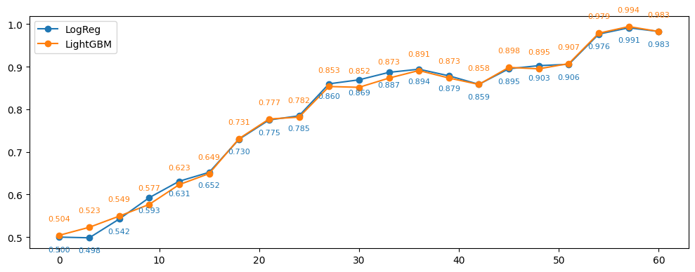

# Предсказание исхода шахматной партии

[*lichess.ipynb*](lichess.ipynb)

---


## Задача

*Требуется предсказать win / not win для новых партий, которые я играю*

#### Признаки до начала игры:

- Разница рейтингов
- Цвет фигур

#### Признаки в некоторый момент игры:

- Номер хода
- Мои фигуры на доске
- Преимущество по фигурам
- Оставшееся у меня время
- Преимущество по времени

#### Выбор модели

| Модель                | Роль       | Преимущества                           |
|-----------------------|------------|----------------------------------------|
| Logistic Regression   | Baseline   | Простая, легко интерпретировать        |
| Gradient Boosting     | Prediction | Нелинейности, взаимодействия признаков |

---


## Результат

#### AUC по номеру хода


#### LogReg
```
train 0.719 | test 0.761 | underfit
```

#### LightGBM
```
train 0.750 | test 0.757 | good fit
```

